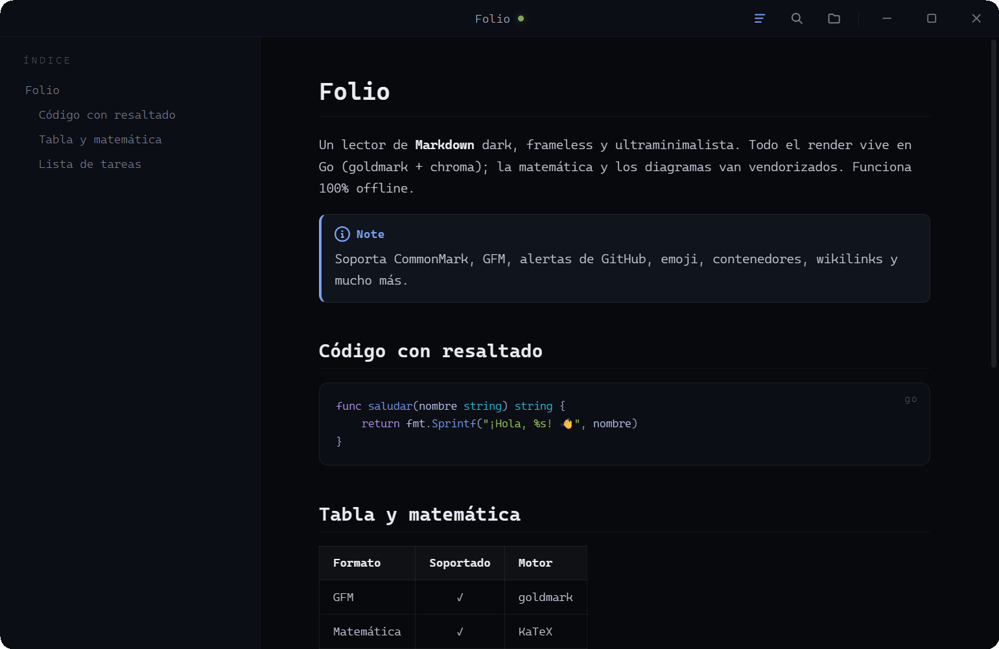

<div align="center">

# Folio

**Un lector de Markdown dark, frameless y ultraminimalista para Windows.**

Todo el render vive en Go — sin Electron, sin navegador, sin CDN. Un solo `.exe` portable.


[](https://github.com/agustinyarrus/folio/releases/latest)
[](https://github.com/agustinyarrus/folio/releases)



</div>

---

## ✨ Qué es

**Folio** es un visor de Markdown minimalista: lo abrís, lee hermoso, te corrés. Una sola ventana
**WebView2 sin marco del sistema** — la barra de título y los botones los dibuja la propia página.
El Markdown lo convierte a HTML **Go** (goldmark + chroma) compilado dentro del `.exe`; la matemática
(KaTeX) y los diagramas (mermaid) van vendorizados. **Funciona 100% offline** y arranca en ~0.5 s.

## 🧩 Soporta "todos los formatos"

- **CommonMark** completo + **GFM**: tablas, tachado, autolinks, listas de tareas.
- **Alertas estilo GitHub**: `> [!NOTE]`, `[!TIP]`, `[!IMPORTANT]`, `[!WARNING]`, `[!CAUTION]` con ícono y color.
- **Emoji** por atajo: `:tada:` → 🎉 (unicode real, offline).
- **Marcas inline** (Pandoc / markdown-it): `==resaltado==`, `++insertado++`, `x^2^`, `H~2~O`.
- **Wikilinks** (Obsidian): `[[Página]]`, `[[Página|alias]]`, `[[Página#sección]]`.
- **Contenedores** (Pandoc / VuePress): `::: warning … :::`, anidables, con título propio.
- **Abreviaturas** (Markdown Extra): `*[HTML]: HyperText Markup Language`.
- **Markdown embebido**: un bloque ` ```markdown ` se renderiza formateado dentro de su caja.
- **IDs de encabezado propios** `{#mi-ancla}`, footnotes, listas de definición, tipografía, frontmatter YAML.
- **Resaltado de código** por lenguaje (chroma, paleta Tokyo Night) con botón de copiar.
- **Matemática** `$...$` / `$$...$$` (KaTeX) y **diagramas** ```mermaid```.

## 🎛️ Características

- **Índice (TOC)** lateral autogenerado, de **ancho arrastrable**, con resaltado de la sección activa.
- **Recarga en vivo**: editás el `.md` en cualquier editor y la vista se actualiza sola (SSE), conservando el scroll.
- **Búsqueda** in-page (Ctrl F) con resaltado vía CSS Custom Highlight API.
- **Zoom de lectura** (Ctrl ±) recordado entre sesiones.
- **Pantalla completa**, **instancia única** (la 2ª apertura reusa la ventana viva), arrastrar-y-soltar.
- Esquinas redondeadas y borde oscuro nativos de Windows 11.

## ⌨️ Atajos

| Tecla                | Acción                          |
|----------------------|---------------------------------|
| `Ctrl O`             | Abrir documento                 |
| `Ctrl F`             | Buscar (`Enter` / `Shift+Enter`)|
| `T`                  | Mostrar/ocultar índice          |
| `Ctrl ±` / `Ctrl+rueda` | Tamaño de letra (se recuerda)|
| `F` / `F11`          | Pantalla completa               |
| `g` / `G`            | Ir arriba / abajo               |
| `Espacio` / `PgUp/Dn`| Desplazar                       |

## 📦 Instalación

> Requiere [**Go**](https://go.dev) 1.24+ para compilar y el **runtime de WebView2** (viene de fábrica en Windows 11).

```powershell
git clone https://github.com/agustinyarrus/folio.git
cd folio
.\build.ps1      # compila folio.exe (release, sin consola, con icono)
.\install.ps1    # instala en Program Files + Menú de Inicio y lo asocia a .md (UAC)
```

`.\install.ps1 -Uninstall` revierte la instalación. O simplemente corré el `.exe`:

```powershell
folio.exe ruta\al\documento.md
```

## 🏗️ Arquitectura

| Archivo          | Rol                                                                    |
|------------------|------------------------------------------------------------------------|
| `main.go`        | Host frameless + servidor HTTP local + instancia única + recarga viva  |
| `render.go`      | Pipeline goldmark: TOC, código (chroma), enlaces, frontmatter          |
| `alerts.go`      | Alertas estilo GitHub (`> [!NOTE]`…)                                   |
| `inline_ext.go`  | Marcas inline `==mark==`, `++ins++`, `^sup^`, `~sub~`                  |
| `wikilink.go`    | Enlaces wiki `[[Página]]`                                              |
| `abbr.go`        | Abreviaturas `*[CLAVE]: …` → `<abbr>`                                  |
| `containers.go`  | Contenedores `::: nombre … :::`                                        |
| `mathext.go`     | Extensión propia `$...$` / `$$...$$`                                   |
| `winapi.go`      | Diálogo nativo de apertura, pantalla completa                          |
| `ui/`            | HTML + CSS + JS embebidos (`//go:embed`) y librerías vendorizadas      |

## 📄 Licencia

MIT © Agustín Yarrus — ver [LICENSE](LICENSE).
