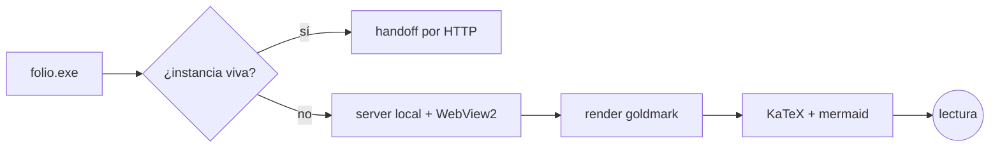
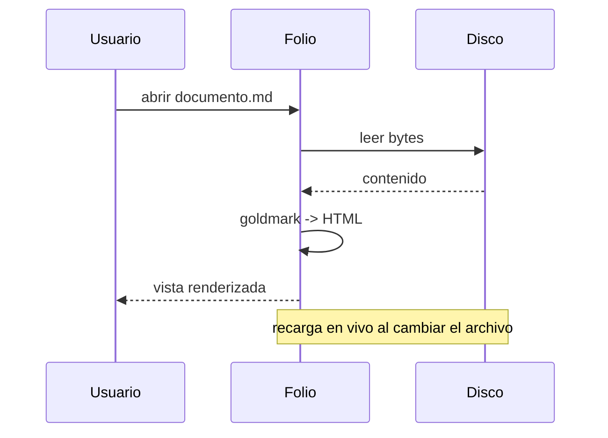

# Folio — Prueba de fuego

Un documento que ejercita **todos los formatos** de Markdown que Folio soporta: CommonMark,
GFM, footnotes, listas de definición, tipografía, matemática y diagramas. Si esto se ve
hermoso, el lector está completo.

> "La tipografía es la voz visible del lenguaje." — alguien con buen gusto[^1]

## Énfasis y texto

Texto en *cursiva*, en **negrita**, en ***ambas***, ~~tachado~~, `código en línea`, y
sub/superíndices vía HTML: H<sub>2</sub>O y E = mc<sup>2</sup>. Comillas tipográficas:
"así quedan" y guiones --- largos. Una tecla: <kbd>Ctrl</kbd> + <kbd>F</kbd>.

Un enlace [externo a example.com](https://example.com), un enlace [interno](#tablas), un
autolink https://github.com y un correo contacto@ejemplo.com.

## Listas

### Sin orden
- Primer punto
- Segundo punto
  - Anidado uno
  - Anidado dos
    - Más profundo
- Tercero

### Ordenada
1. Preparar el café
2. Abrir el editor
3. Escribir Markdown
4. Mirarlo en Folio

### Tareas
- [x] Diseñar el host frameless
- [x] Render con goldmark + chroma
- [x] KaTeX y mermaid
- [ ] Conquistar el mundo
- [ ] Dormir

## Listas de definición

Markdown
: Lenguaje de marcado ligero para texto con formato.

Goldmark
: Parser de Markdown en Go, compatible con CommonMark y GFM.

## Tablas

| Componente | Lenguaje | Rol                          | Estado |
|:-----------|:--------:|:-----------------------------|-------:|
| Host       | Go       | Ventana WebView2 frameless   |     OK |
| Render     | Go       | goldmark + chroma            |     OK |
| Matemática | JS       | KaTeX (vendorizado)          |     OK |
| Diagramas  | JS       | mermaid (vendorizado)        |     OK |

## Código con resaltado

```go
package main

import "fmt"

// saluda imprime un saludo cordial.
func saluda(nombre string) string {
	return fmt.Sprintf("¡Hola, %s! 👋", nombre)
}

func main() {
	for i := 0; i < 3; i++ {
		fmt.Println(saluda("Folio"))
	}
}
```

```python
from dataclasses import dataclass

@dataclass
class Punto:
    x: float
    y: float

    def norma(self) -> float:
        return (self.x ** 2 + self.y ** 2) ** 0.5

print(Punto(3, 4).norma())  # 5.0
```

```javascript
const fib = (n) => (n < 2 ? n : fib(n - 1) + fib(n - 2));
console.log([...Array(10)].map((_, i) => fib(i)));
```

## Matemática (KaTeX)

La identidad de Euler, en línea: $e^{i\pi} + 1 = 0$. Y una integral gaussiana destacada:

$$
\int_{-\infty}^{\infty} e^{-x^2}\,dx = \sqrt{\pi}
$$

Una matriz y una suma:

$$
A = \begin{pmatrix} a & b \\ c & d \end{pmatrix}
\qquad
\sum_{k=1}^{n} k = \frac{n(n+1)}{2}
$$

## Diagramas (mermaid)





## Alertas estilo GitHub

> [!NOTE]
> Una nota informativa. Admite **formato**, `código` y [enlaces](https://example.com) adentro.

> [!TIP]
> Un consejo útil para sacarle el jugo a la herramienta.

> [!IMPORTANT]
> Información crucial que conviene no pasar por alto.

> [!WARNING]
> Advertencia: algo podría salir mal si no prestás atención.

> [!CAUTION]
> Precaución: esta acción es potencialmente peligrosa.

## Emoji

Atajos de emoji: :tada: :rocket: :sparkles: :heart: :+1: :coffee: :fire: :books: :bug: :zap:.

## Marcas inline extra

Texto ==resaltado== con `==`, ++insertado++ con `++`, superíndice x^2^ y e^10^, subíndice
H~2~O y CO~2~ — todo en Markdown puro (sin HTML). El tachado de GFM ~~sigue intacto~~.

## Enlaces wiki

Un wikilink simple [[Arquitectura]], uno con alias [[Arquitectura|ver el diseño]], uno hacia
una sección [[Tablas#encabezado]] y un ancla local [[#emoji]].

## Encabezado con id propio {#mi-ancla}

Este encabezado fija su propio identificador con `{#mi-ancla}`.

## Bloque colapsable

<details>
<summary>Ver detalles ocultos</summary>

Contenido que aparece al expandir, con **formato**, una lista:

- uno
- dos

y código:

```bash
echo "hola desde el detalle"
```

</details>

## Abreviaturas y teclas

La <abbr title="HyperText Markup Language">HTML</abbr> y la <abbr title="Cascading Style
Sheets">CSS</abbr> son estándares de la web. Atajo de paleta: <kbd>Ctrl</kbd> +
<kbd>Shift</kbd> + <kbd>P</kbd>.

## Abreviaturas automáticas

Una API REST bien diseñada documenta cada recurso; toda API expone endpoints y un cliente REST
los consume. Las siglas se definen una vez y se marcan solas en todo el texto.

*[API]: Application Programming Interface
*[REST]: Representational State Transfer

## Contenedores `:::`

::: tip
Un contenedor *tip* con **Markdown** adentro y una lista:

- elemento uno
- elemento dos
:::

::: warning Atención especial
Contenedor con título personalizado.
:::

::: danger
Zona peligrosa.
:::

::: {.nota-propia #seccion-x}
Contenedor con clase e id crudos vía llaves.
:::

Y un enlace a otra página que salta a una sección concreta: [tablas de la guía](guia.md#tablas).

## Markdown embebido

Un bloque de código etiquetado `markdown` se renderiza formateado dentro de su caja (útil para
pegar el contenido de otros `.md`/`.mdc` y verlo con formato, no como fuente):

```markdown
# Título embebido

Un párrafo con **resaltado-embebido**, `código en línea` y una lista:

- punto uno
- punto dos
```

## Cita anidada y separador

> Nivel uno
>> Nivel dos
>>> Nivel tres

---

## Texto largo para probar el scroll y el progreso

Lorem ipsum dolor sit amet, consectetur adipiscing elit. Sed do eiusmod tempor incididunt ut
labore et dolore magna aliqua. Ut enim ad minim veniam, quis nostrud exercitation ullamco
laboris nisi ut aliquip ex ea commodo consequat.

Duis aute irure dolor in reprehenderit in voluptate velit esse cillum dolore eu fugiat nulla
pariatur. Excepteur sint occaecat cupidatat non proident, sunt in culpa qui officia deserunt
mollit anim id est laborum.

### Más contenido

Sección final para confirmar que el índice resalta correctamente la sección activa mientras
uno baja, y que la barra de progreso llega al 100%.

[^1]: Esta es una nota al pie, con su enlace de regreso al texto.
